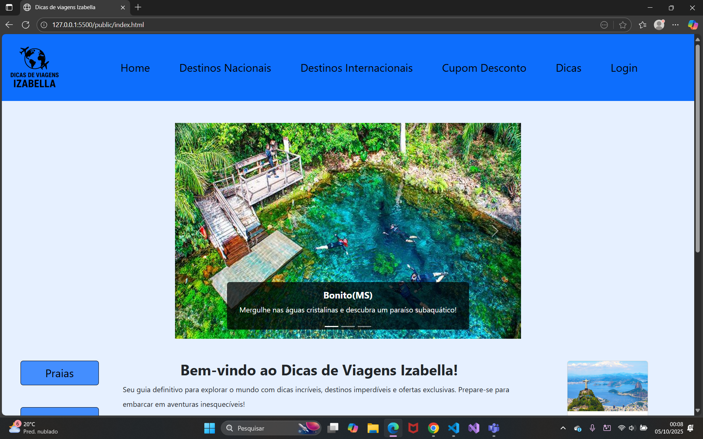
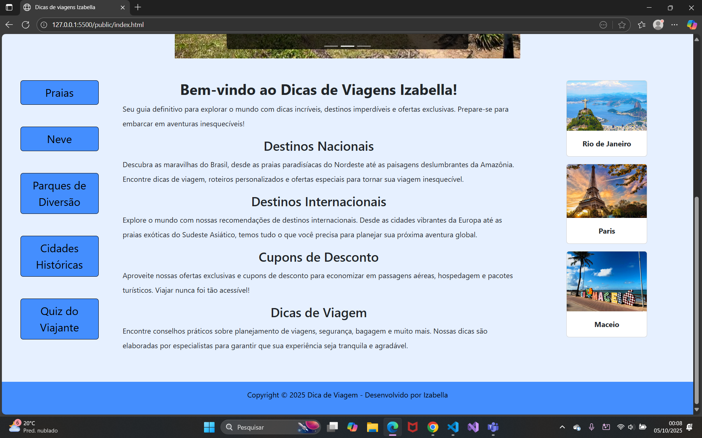
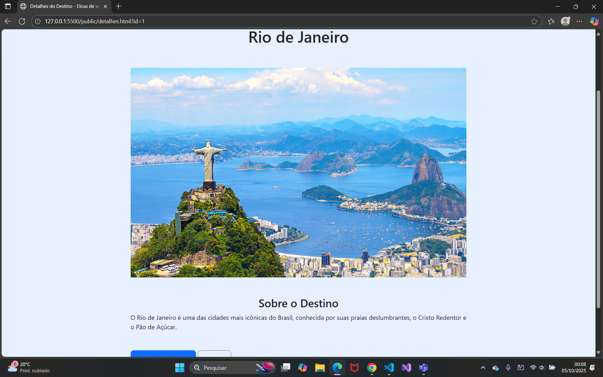

[](https://classroom.github.com/online_ide?assignment_repo_id=20888255&assignment_repo_type=AssignmentRepo)
# Trabalho Prático 05 - Semanas 7 e 8

**Páginas de detalhes dinâmicas**

Nessa etapa, vamos evoluir o trabalho anterior, acrescentando a página de detalhes, conforme o  projeto escolhido. Imagine que a página principal (home-page) mostre um visão dos vários itens que existem no seu site. Ao clicar em um item, você é direcionado pra a página de detalhes. A página de detalhe vai mostrar todas as informações sobre o item do seu projeto. seja esse item uma notícia, filme, receita, lugar turístico ou evento.

Leia o enunciado completo no Canvas. 

**IMPORTANTE:** Assim como informado anteriormente, capriche na etapa pois você vai precisar dessa parte para as próximas semanas. 

**IMPORTANTE:** Você deve trabalhar e alterar apenas arquivos dentro da pasta **`public`,** mantendo os arquivos **`index.html`**, **`styles.css`** e **`app.js`** com estes nomes, conforme enunciado. Deixe todos os demais arquivos e pastas desse repositório inalterados. **PRESTE MUITA ATENÇÃO NISSO.**

## Informações Gerais

- Nome: Izabella Regina Elias Evangelista
- Matricula: 901340
- Proposta de projeto escolhida: 2
- Breve descrição sobre seu projeto: Dicas de viagens para destinos nacionas, internacionais...

## Print da Home-Page




## Print da página de detalhes do item



## Cole aqui abaixo a estrutura JSON utilizada no app.js
``` javascript
const dados = [
  {
    "id": 1,
    "titulo": "Rio de Janeiro",
    "descricao": "A cidade oferece uma mistura perfeita de natureza exuberante, cultura vibrante e vida noturna agitada.",
    "conteudo": "O Rio de Janeiro é uma das cidades mais icônicas do Brasil, conhecida por suas praias deslumbrantes, o Cristo Redentor e o Pão de Açúcar.",
    "categoria": "Destinos Nacionais",
    "imagem": "img/rio.jpeg"
  },

  {
    "id": 2,
    "titulo": "Paris",
    "descricao": "Paris, conhecida como 'Cidade Luz', é famosa por sua arquitetura icônica, como a Torre Eiffel e a Catedral de Notre-Dame, seus cafés charmosos, ruas elegantes e rica cena artística e cultural.",
    "conteudo": "Paris, a capital da França, encanta com seus monumentos famosos, ruas elegantes, gastronomia refinada e uma rica vida cultural e artística.",
    "categoria": "Destinos Internacionais",
    "imagem": "img/paris.webp"
  },

  {
    "id": 3,
    "titulo": "Maceio",
    "descricao": "Maceió, capital de Alagoas, é famosa por suas praias de águas cristalinas, coqueirais e piscinas naturais.",
    "conteudo": "Maceió encanta turistas com suas praias paradisíacas, como Pajuçara e Praia do Francês, além de cultura rica e culinária típica nordestina.",
    "categoria": "Destinos Nacionais",
    "imagem": "img/maceio.jpeg"
  },
]


const cardsContainer = document.getElementById('cards-lateral');
let html = '';
for (let i = 0; i < dados.length; i++) {
  html += `
    <a href="detalhes.html?id=${dados[i].id}" class="text-decoration-none">
        <div class="card w-50  mx-auto mb-3">
            
            <div class="card-body">
                <p class="card-text text-center fw-bold ">${dados[i].titulo}</p>
            </div>
        </div>
    </a>
    `
}

if (cardsContainer)
cardsContainer.innerHTML = html;


const urlParams = new URLSearchParams(window.location.search);
const id = urlParams.get('id');


const tituloElement = document.getElementById('cidade');
const tituloText = tituloElement.textContent

const descricaoElement = document.getElementById('descricao');
const descricaoText = descricaoElement.textContent

const imagemElement = document.getElementById('fotocidade');
const imagemSrc = imagemElement.getAttribute('src');

for (let i = 0; i < dados.length; i++) {
  if (dados[i].id == id) {
    tituloElement.textContent = dados[i].titulo;
    descricaoElement.textContent = dados[i].conteudo;
    imagemElement.setAttribute('src', dados[i].imagem);
    imagemElement.setAttribute('alt', dados[i].titulo);
    break;
  }
}
```
